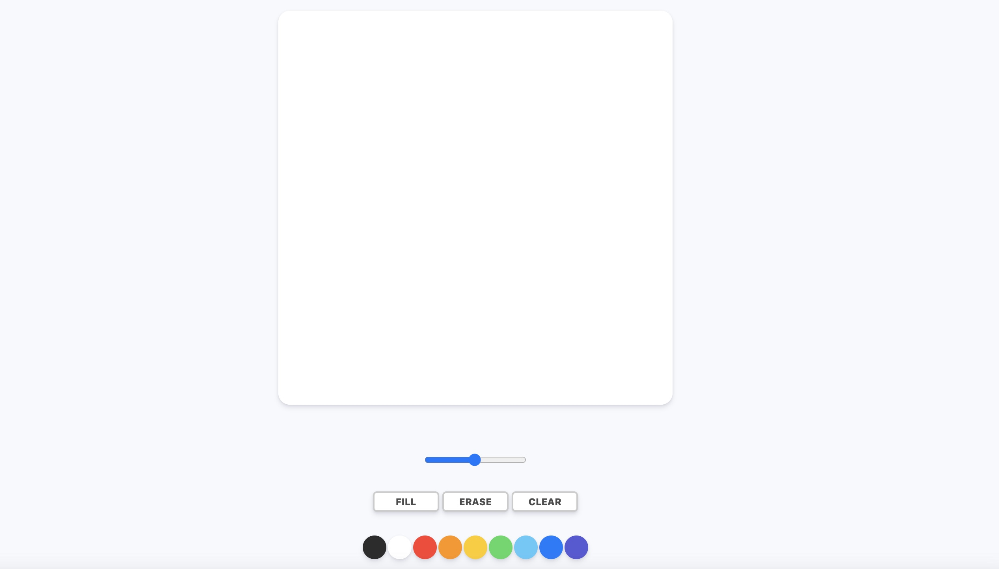
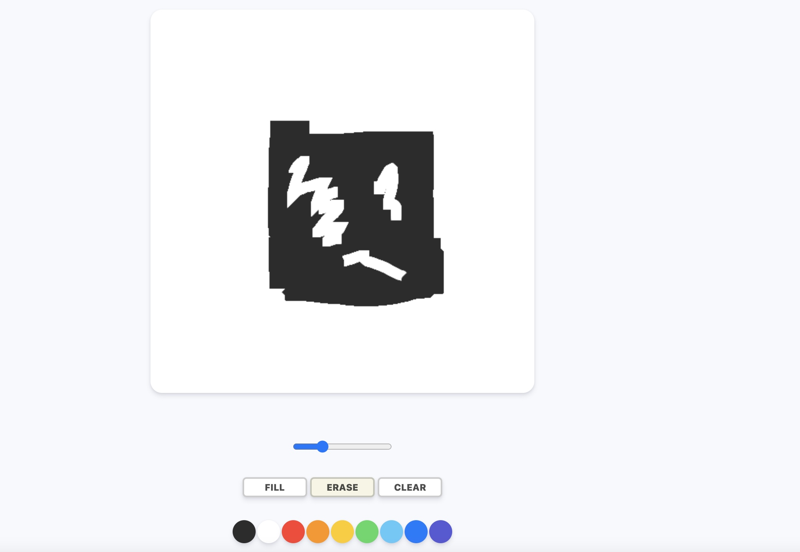
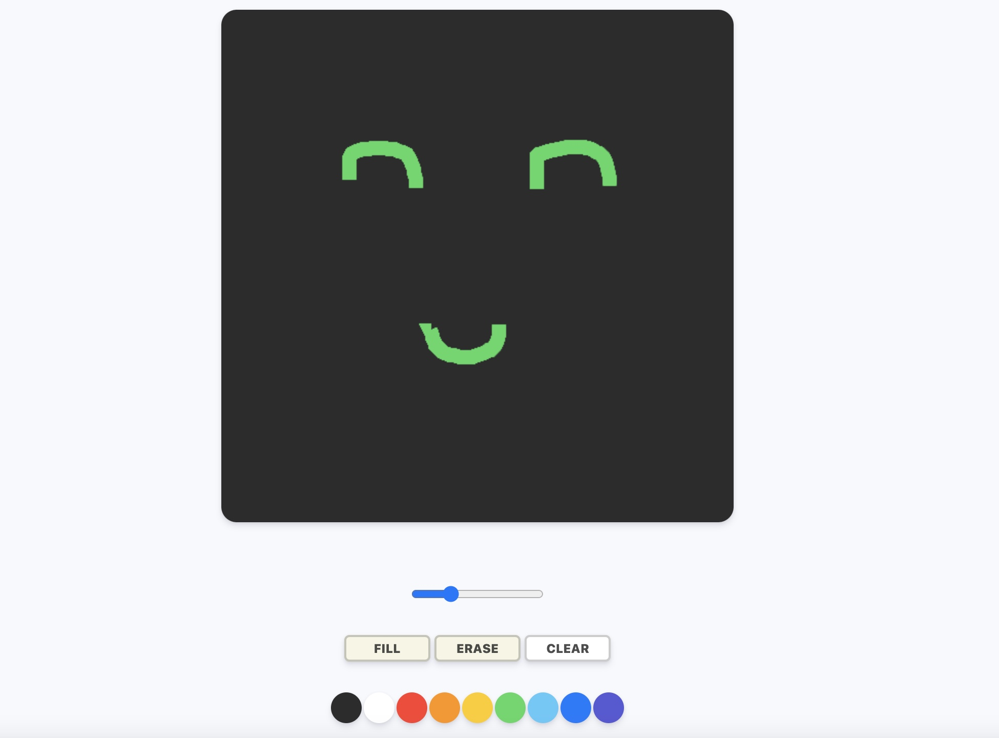

# Paint with Js

| Feature            | Image                                              |
| ------------------ | -------------------------------------------------- |
| Home Page          |            |
| Use Erase          |            |
| Use fill and paint |   |

- ## <사용기술>

- - [x]  canvas api 사용
       
        - getContext("2d") 를 사용하여, 2d를 사용할수 있도록 구현.
        - context의 strokeStyle을 통해, 선의 색상을 구현
        - range와 context의 lineWidth를 통해, 선의 굵기를 조절
  ---

- - [x]  여러가지 event 사용
       
        - mousemove를 사용 
          canvas내에서 마우스가 움직임을 인지하여, 선을 구현

        - mousedown을 사용 
          canvas내에서 마우스를 클릭시, 선을 구현

        - mouseup을 사용 
          canvas내에서 마우스 클릭상태에서, 땔경우, 나타나는 선을 중단

        - mouseleave을 사용 
          canvas내에서만 작동을 해주기 위해 mouseleave를 사용.

  ---

 

- ## <정보>
- - [x]  clientX와 offsetX의 차이점 : clientX는 window를 기준으로서의 크기이고, offsetX는 크기를 지정한, (paintJs에선) canvas내에서의 위치이다.      
  만약 window와 canvas의 크기가 같다면, clientX와 offsetX의 크기는 같다.

   
- - [x]  canvas에서 선을 구현하는 원리 : 
  1. beginPath를 통해, 시작한다.
  2. moveTo(x,y)를 통해 x,y 즉 마우스가 움직이는 곳으로 보이지 않는 선을 계속 만든다. =>
  3. mousedown과 같이 선을 나타내도록 할 경우, 나타내도록 하는 그 시작점부터, 
  lineTo(x,y)를 통해 따라가는 선 같은것을 만든다.
  4. lineTo(x,y)를 통해 따라가는 선을 stroke()를 통해 나타내준다.     
  5. mouseup과 같이 선을 나타내지 않도록 할 경우, 다시 lineTo(x,y)로 나타낸 부분을 안보이게 해준다.